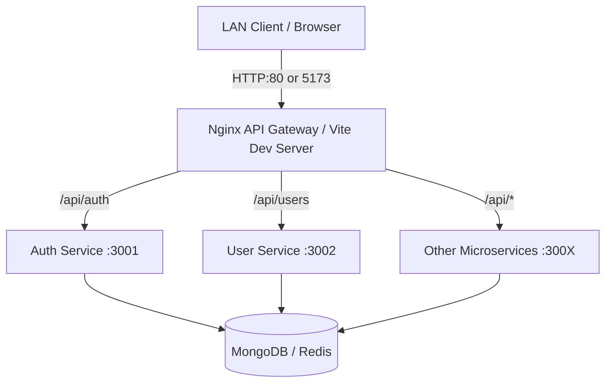

# MASTER LAN ARCHITECTURE & NETWORK FLOW

## 1. Network Topology
EduSphere is designed to operate seamlessly over a Local Area Network (LAN), allowing multi-device access (e.g., student laptops, faculty tablets, admin PCs) connected to the same institutional Wi-Fi/Intranet.

## 2. Infrastructure Bindings

### Vite Dev Server (Frontend)
- **Configuration File**: `frontend/vite.config.js`
- **Host Binding**: `host: true` (equivalent to `0.0.0.0`)
- **Port**: `5173`
- **Impact**: Clients on the LAN can access the React application via `http://<HOST_IP>:5173`.
- **API Proxying**: Vite dynamically proxies `/api/*` to either the Nginx Gateway (`USE_GATEWAY=true`) or directly to the `localhost:300X` microservices based on development `.env`. Since the proxy runs *on the host machine*, LAN clients do not need direct access to the microservices.

### Nginx API Gateway (Production/Docker)
- **Configuration File**: `backend/gateway/nginx.conf`
- **Listen Directive**: `listen 80;`
- **Upstream Resolution**: Resolves Docker container hostnames (e.g., `es_auth`, `es_courses`) via the internal Docker bridge network (`edusphere_net`).
- **Impact**: Exposes the unified API entrypoint and built frontend to the LAN on port 80 (`http://<HOST_IP>/`).

### Microservices (Docker Compose)
- **Configuration File**: `infra/docker-compose.yml`
- **Port Mapping**: Explicitly maps ports (`"3001:3001"`, etc.).
- **Impact**: While Nginx handles routing within the Docker network, the explicit port mappings allow developers to run the Vite dev server directly on the host machine and route to the Dockerized backend if `USE_GATEWAY=false`.

## 3. Localhost Hardcoding Audit
A comprehensive audit of the frontend source code (`frontend/src`) revealed that **NO** production API calls are hardcoded to `http://localhost`. All requests use relative paths (`/api/...`), ensuring that the browser natively prepends the current LAN IP of the host.

*(Note: The only `localhost` references found were mock strings within the Admin Portal's `SystemHealth` component for UI display purposes, which do not affect network routing).*

## 4. Multi-Tenant Session Handling over LAN
Because authentication tokens (`edu_token`) and user identities (`edu_user`) are stored in `localStorage` on the client browser, concurrent LAN sessions are perfectly isolated. 
- Student A logging in from `192.168.1.100` receives a unique token.
- Faculty B logging in from `192.168.1.105` receives a unique token.
- The server identifies sessions via the `Authorization: Bearer <token>` header on every API request.
