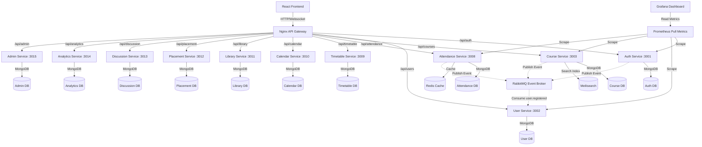
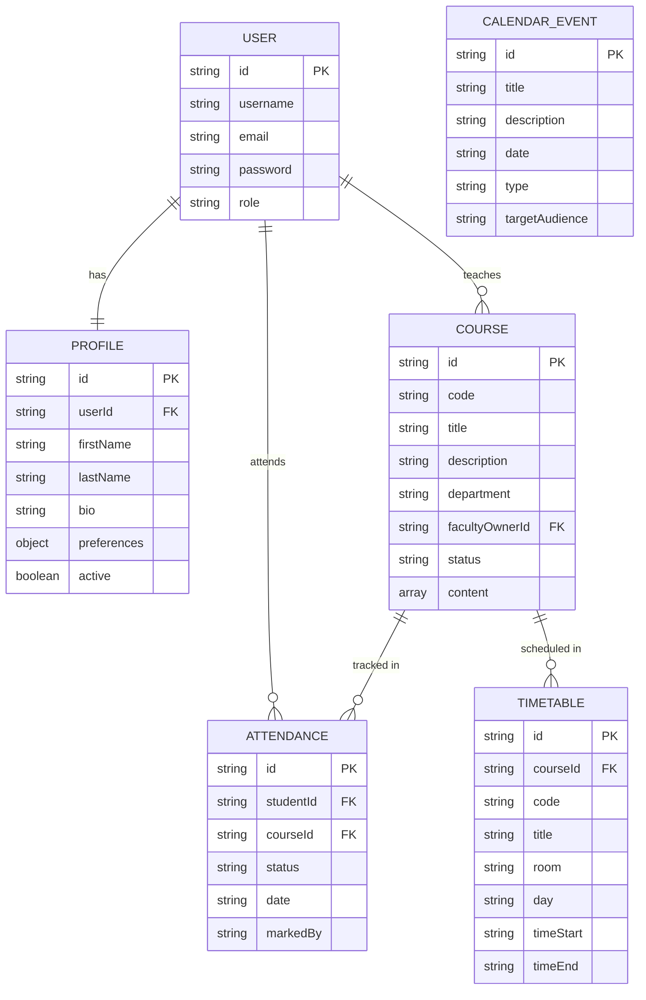

# Software Design Document (SDD) - EduSphere Enterprise

## 1. System Architecture Diagram



---

## 2. Microservice MVC Folder Structure

Every microservice in the EduSphere ecosystem adheres to a strict MVC (Model-View-Controller) architecture layout for high code readability, separation of concerns, and ease of maintainability:

```
services/<service-name>/
  ├── src/
  │   ├── config/       # Databases, Redis caches, and RabbitMQ connection configurations
  │   ├── models/       # Mongoose Schemas & entities definitions
  │   ├── routes/       # Express route handlers definition
  │   ├── controllers/  # Core request handling and data mutation logic
  │   ├── middleware/    # Auth middleware (JWT + RBAC role verification)
  │   └── server.js     # Express server setup and routing registrations
  ├── Dockerfile        # Container image packing configuration
  ├── package.json      # Dependencies configuration
  └── server.js         # Entrypoint redirect to src/server.js
```

---

## 3. Database Schema ERD



---

## 4. Event Topologies & Eventual Consistency

1. **`user.registered` event:**
   - **Producer:** Auth Service upon registering a new student.
   - **Routing Key:** `user.registered`
   - **Consumers:** User Service initializes profile record; Notification Service sends confirmation email.
2. **`attendance.marked` event:**
   - **Producer:** Attendance Service when faculty saves a marking.
   - **Routing Key:** `attendance.marked`
   - **Consumers:** Cache invalidation; Audit logs.
3. **`course.created` event:**
   - **Producer:** Course Service when a course proposal is registered.
   - **Consumers:** Academic Calendar (future) marks course review periods.
